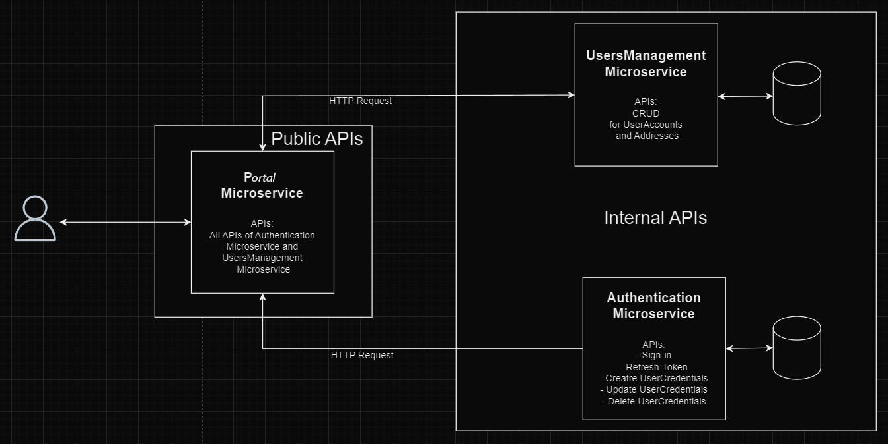

# Microservice Gateway API

## Overview

**Microservice Gateway API** is a centralized API for handling user authentication, user account management, and address management across multiple services. It acts as a gateway, using various HTTP clients to communicate securely and efficiently with underlying microservices. This service is designed to illustrate different methods of API integration, showcasing Feign Client, Apache HttpClient, and RestTemplate to demonstrate flexibility and best practices in service-to-service communication.

## Table of Contents

- [Features](#features)
- [Technologies Used](#technologies-used)
- [Architecture](#architecture)
- [Endpoints](#endpoints)

## Features

- User authentication and JWT-based authorization.
- User account management including create, update, and delete operations.
- Address management with create, update, delete, and retrieval functionalities.
- Custom error handling with Feign Client.

## Technologies Used

- **Java 21**
- **Spring Boot 3**
- **Spring Cloud OpenFeign**
- **Apache HttpClient**
- **Spring RestTemplate**
- **Spring Security**
- **Spring Data JPA**
- **Lombok**
- **Gradle**
- **Swagger**
- **JSON Web Tokens (JWT)**
- **Docker**
- -**Liquibase**

## Architecture

## Endpoints

### Authentication Service
- **POST** `/sign-in`  
  **Request Body:** `UserCredentialsDTO`  
  **Response:** `AuthenticationResponseDTO`

- **POST** `/refresh-token`  
  **Request Header:** `Authorization`  
  **Response:** `AuthenticationResponseDTO`

### User Credentials Service
- **POST** `/register`  
  **Request Body:** `UserCredentialsDTO`  
  **Response:** `AuthenticationResponseDTO`

- **PUT** `/update`  
  **Request Body:** `UserCredentialsDTO`  
  **Response:** `UserCredentialsDTO`

- **DELETE** `/delete`  
  **Request Body:** `UserCredentialsDTO`  
  **Response:** `Void`

### Address Service
- **POST** `/create`  
  **Request Body:** `AddressDTO`  
  **Response:** `AddressDTO`

- **PUT** `/update`  
  **Request Body:** `AddressDTO`  
  **Response:** `AddressDTO`

- **DELETE** `/{addressId}`  
  **Request Path:** `addressId`  
  **Response:** `Void`

- **GET** `/{addressId}`  
  **Request Path:** `addressId`  
  **Response:** `AddressDTO`

- **GET** `/get-by-user-id/{userId}`  
  **Request Path:** `userId`  
  **Response:** `List<AddressDTO>`

- **GET** `/all`  
  **Request Parameters:** `page`, `size`, `sort`  
  **Response:** `Page<AddressDTO>`

### User Account Service
- **POST** `/create`  
  **Request Body:** `UserAccountDTO`  
  **Response:** `UserAccountDTO`

- **GET** `/{id}`  
  **Request Path:** `id`  
  **Response:** `UserAccountDTO`

- **PUT** `/update`  
  **Request Body:** `UserAccountDTO`  
  **Response:** `UserAccountDTO`

- **DELETE** `/{id}`  
  **Request Path:** `id`  
  **Response:** `Void`

- **GET** `/search-by-name`  
  **Request Parameters:** `name`, `size`, `page`, `sort`  
  **Response:** `Page<UserAccountDTO>`
